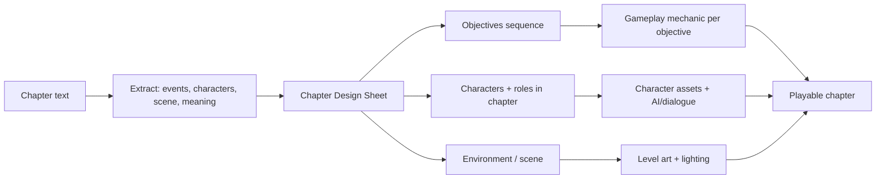

# Ramayana — Mobile Story Game: Master Plan

Source: [ramayana_complete_illustrative_retelling.txt](ramayana_complete_illustrative_retelling.txt) (10 Parts, 39 Chapters; each chapter has STORY / VISUAL PORTRAIT / SCENE / SUMMARY).

---

## 1. Game Vision

| Item | Proposal |
|---|---|
| Genre | Story-driven 3D action-adventure (third-person), chapter-based, linear |
| Platform | Android first (phones + tablets), iOS later from same project |
| Engine | **Unity 6 LTS + URP** (best mobile scalability, one project for low → high devices, easy iOS port) |
| Structure | 10 Acts (= Parts) → 39 Chapters → 2–5 sequential Objectives each |
| Session length | 10–20 min per chapter (mobile-friendly), checkpoint after every objective |
| Total playtime | ~10–14 hours |
| Tone | Respectful, cinematic, faithful to the retelling; no mockery of divine figures |

### Core idea: "The hero changes as the story changes"
Two layers:

1. **Hero Arc (Rama evolves)** — Rama's model, costume, age, weapons and abilities change per Act:
   - Act I: Child / young prince (training bow, basic moves)
   - Act II: Prince of Ayodhya (royal silk, Shiva's bow moment, divine astras from Vishvamitra)
   - Act III–IV: Exile (bark cloth, matted hair, forest survival skills, Kodanda bow)
   - Act V–VIII: Warrior of the alliance (army command, celestial weapons, Brahmastra finale)
   - Act IX–X: King Rama (royal form, mostly narrative/king decisions)
2. **Perspective Chapters (playable character switches)** — the story is told through whoever drives it:
   - Dasharatha (memory), Bharata, Jatayu, Hanuman, Lakshmana, Lava & Kusha.

Each playable form = one `CharacterForm` data asset (model + moveset + abilities), so switching is data, not new code.

---

## 2. How the Story Becomes a Game (Pipeline)



### Chapter Design Sheet (one per chapter)
- **Story beat**: what must happen (from STORY)
- **Playable character + form**
- **Companions / NPCs / enemies / boss**
- **Scene** (from SCENE section): location, time of day, mood
- **Objectives** (strict order): e.g. `Talk → Travel → Fight → Cutscene`
- **Mechanic** for each objective (combat, chase, stealth, puzzle, dialogue, flight, QTE)
- **Unlocks** at completion (ability, costume, codex entry, next chapter)
- **Meaning card** (from SUMMARY AND MEANING) shown at chapter end

---

## 3. Chapter → Gameplay Map (first draft, verify against text)

| # | Chapter | Playable | Gameplay | Key characters / boss | Unlock |
|---|---|---|---|---|---|
| **ACT I — Birth of Rama** |||||
| 1 | Ayodhya, City of a King | Dasharatha (prologue) | Cinematic + city walk tutorial | Dasharatha, queens, Vasishtha | — |
| 2 | Four Brothers | Child Rama | Training ground: move, bow tutorial, sibling mini-games | Lakshmana, Bharata, Shatrughna | Basic bow |
| 3 | Arrival of Vishvamitra | Young Rama | Dialogue, departure journey | Vishvamitra, Dasharatha | Stamina (Bala/Atibala) |
| 4 | Tataka and the Forest of Tests | Young Rama (+Lakshmana AI) | Forest combat, **Boss: Tataka**, yajna defence | Tataka, Maricha | First divine astra |
| 5 | Ahalya | Young Rama | Exploration / restoration puzzle | Ahalya, Gautama | Codex |
| **ACT II — Sita and the Bow of Shiva** |||||
| 6 | Mithila and King Janaka | Rama | Exploration + **Shiva's bow** timing/strength mini-game | Janaka, Sita, Urmila | Prince costume |
| 7 | The Road Back to Ayodhya | Rama | Non-combat "duel of will" QTE | Parashurama | Vishnu's bow |
| **ACT III — The Exile** |||||
| 8 | Kaikeyi's Two Boons | Rama | Narrative palace chapter; costume change to exile | Kaikeyi, Manthara, Dasharatha | Exile form |
| 9 | Sita Chooses the Forest | Rama | Dialogue chapter | Sita, Kausalya | Sita joins story |
| 10 | Ayodhya Watches Them Go | Rama | Chariot/escort sequence, river crossing | Sumantra, citizens | — |
| 11 | The Death of Dasharatha | Dasharatha (memory) | Short playable memory + cinematic | Dasharatha | — |
| 12 | Bharata in the Forest | **Bharata** | Journey level, meeting at Chitrakoot | Bharata, Rama | Padukas (story item) |
| **ACT IV — The Forest Years** |||||
| 13 | Panchavati | Rama | Forest hub: gather, build hut, explore | Sita, Lakshmana, Shurpanakha | Hub area |
| 14 | Khara and the Forest War | Rama | Horde battle (large enemy waves) | Khara, Dushana | Area-attack astra |
| 15 | The Golden Deer | Rama | Chase / runner sequence | Maricha | — |
| 16 | The Abduction of Sita | **Jatayu** | Aerial battle vs Ravana (scripted loss) | Ravana, Sita, Jatayu | — |
| 17 | Rama's Search | Rama | Tracking/exploration, clue trail | Jatayu (dying) | Tracking vision |
| **ACT V — Kishkindha** |||||
| 18 | Hanuman Meets Rama | Rama | Dialogue, alliance | Hanuman, Sugriva | Hanuman ally |
| 19 | Sugriva and Vali | Rama | Support-archer duel sequence | Vali, Sugriva | — |
| 20 | The Search for Sita | Vanara team | Squad exploration | Angada, Jambavan | — |
| 21 | Hanuman Remembers His Strength | **Hanuman** | Power-awakening sequence | Jambavan | Hanuman full form |
| **ACT VI — Hanuman in Lanka** |||||
| 22 | The Ocean Crossing | Hanuman | Flight / runner over ocean with obstacles | Ocean guardians | Flight |
| 23 | The Search for Sita | Hanuman | **Stealth** in Lanka at night (size change) | Rakshasa guards | Shrink ability |
| 24 | Sita and Hanuman | Hanuman | Ashoka grove, ring delivery | Sita | — |
| 25 | Hanuman Sets Lanka Ablaze | Hanuman | Free-run / parkour destruction escape | Rakshasa army | — |
| **ACT VII — The Bridge** |||||
| 26 | The Return of Hanuman | Rama | Bridge building puzzle/management | Nala, vanara army | Army command |
| 27 | Vibhishana Leaves Ravana | Rama | Dialogue / trust decision (canon outcome) | Vibhishana | Lanka intel |
| **ACT VIII — The War** |||||
| 28 | The Armies Meet | Rama | Large battle with army commands, **Boss: Kumbhakarna** | Kumbhakarna | — |
| 29 | Indrajit | Rama | Invisible-enemy fight (survive) | Indrajit | — |
| 30 | The Mountain of Herbs | **Hanuman** | Timed flight + mountain carry | — | — |
| 31 | Lakshmana and Indrajit | **Lakshmana** | **Boss: Indrajit** | Indrajit | — |
| 32 | Ravana and Rama | Rama | **Final Boss: Ravana** (multi-phase) | Ravana | Brahmastra (finale) |
| **ACT IX — Sita Returns** |||||
| 33 | The Meeting | Rama | Cinematic (handled with care) | Sita, Agni | — |
| 34 | Return to Ayodhya | Rama | Celebratory flight/procession | Bharata, citizens | King form |
| 35 | Rama's Rule | King Rama | Kingdom hub, citizen requests | Court | — |
| **ACT X — The Sons of Sita** |||||
| 36 | Valmiki's Hermitage | **Lava & Kusha** | Training, hermitage exploration | Valmiki, Sita | — |
| 37 | The Ashwamedha | Lava & Kusha | Horse capture sequence, confronting the army | Rama's army | — |
| 38 | Sita's Final Return to the Earth | — | Cinematic | Sita | — |
| 39 | The End of Rama's Earthly Life | King Rama | Final cinematic, epilogue "What each character teaches" | All | Gallery / Codex |

---

## 4. Characters: How We Build Each One

### 4.1 Character roles
| Role | Examples | Needs |
|---|---|---|
| Playable | Rama (5 forms), Hanuman, Lakshmana, Bharata, Jatayu, Lava/Kusha, Dasharatha | Controller, full moveset, abilities, VO |
| Companion (AI) | Lakshmana, Sita (forest), Sugriva, Angada, vanaras | Follow/assist AI, combat assist, barks |
| Story NPC | Dasharatha, Kaikeyi, Janaka, Vishvamitra, Vibhishana, Valmiki… | Idle/talk anims, dialogue, cutscenes |
| Enemy | Rakshasa soldiers, archers, beasts | Behaviour tree, 3–5 attack patterns, LODs |
| Boss | Tataka, Khara, Ravana (Ch16 & Ch32), Kumbhakarna, Indrajit | Phase state machine, unique moves, arena |
| Special rigs | Hanuman (tail), Jatayu (bird), Ravana (ten heads), Kumbhakarna (giant) | Custom rig + anims |

### 4.2 Per-character pipeline
1. **Extract** from text: VISUAL PORTRAIT, chapters appearing, relationships, key moments.
2. **Character sheet**: personality, virtue (from Epilogue: Rama—Duty, Sita—Dignity, Lakshmana—Loyalty, Bharata—Renunciation, Hanuman—Devotion, Ravana—Corrupted greatness…), forms per chapter.
3. **Concept art**: front/side/back turnaround, colour palette, costume per form.
4. **3D model**: LOD0 (high), LOD1, LOD2 (low-end). Shared humanoid skeleton for retargeting.
5. **Animation set**: locomotion, combat, abilities, emotes, cutscene-specific.
6. **Behaviour**: player controller OR AI (behaviour tree) OR dialogue-only.
7. **Voice + dialogue**: lines per chapter, localized.
8. **Integration test** on low and high devices.

### 4.3 Interaction model
- **Dialogue**: branching *presentation*, fixed canon outcome (Yarn Spinner or Ink).
- **Companion assist**: context button ("Lakshmana, cover!"), auto-revive, combo attacks.
- **Combat**: archery with aim-assist (Rama/Lakshmana), melee/power (Hanuman), divine astras as cooldown abilities.
- **Story triggers**: objective sequencer fires cutscenes (Unity Timeline) when conditions met.
- **Relationship/virtue meter** (optional): tracks Duty/Loyalty/Devotion from choices in *how* you act, never changes canon.

---

## 5. Technical Requirements

### 5.1 Device tiers (auto-detected at first launch, user override)
| Tier | Example hardware | Render | FPS | Features |
|---|---|---|---|---|
| Low | 3–4 GB RAM, Adreno 610 / Mali-G52, GLES 3.0 | ~720p (render scale 0.7) | 30 | Baked lighting, no/1 shadow cascade, 512–1K textures, LOD2, small crowds |
| Mid | 6 GB RAM, Snapdragon 7-series / Mali-G78 | 1080p | 30–60 | 2 shadow cascades, 1–2K textures, light post-FX |
| High | 8–12 GB+, Snapdragon 8 Gen 2+ / Dimensity 9000+, Vulkan | 1080p–1440p | 60 (120 opt.) | Realtime shadows, 2K textures, bloom/DOF, large GPU-instanced armies |

- Min Android: 8.0 (API 26), 64-bit (arm64-v8a) only, target SDK = current Google Play requirement.
- Graphics APIs: Vulkan (preferred) with OpenGL ES 3.0 fallback.
- Textures: ASTC; Play texture-compression targeting.
- Size: base AAB ≤ 200 MB, each Act downloaded via **Play Asset Delivery** (on-demand); Addressables in Unity.
- Scalability: LODs, dynamic resolution, occlusion culling, GPU instancing, adaptive performance / thermal throttling.
- Offline play; cloud save optional (Google Play Games).
- Controls: touch (virtual stick + context buttons) + Bluetooth gamepad.
- Localization: English + Hindi at launch; Tamil, Telugu, Kannada, Malayalam, Bengali later.

### 5.2 Tools
| Tool | Purpose |
|---|---|
| Unity Hub + Unity 6 LTS (Android Build Support, OpenJDK, SDK & NDK) | Engine + Android builds |
| VS Code + C# Dev Kit / Unity extension | Coding |
| Android Studio (optional) | SDK manager, adb, Logcat, profiling; emulator is **not** reliable for 3D perf — use real devices |
| Android GPU Inspector / Snapdragon Profiler / Arm Performance Studio | GPU profiling |
| Blender | Modelling, rigging, animation |
| Git + Git LFS | Version control for code and large assets |
| Yarn Spinner or Ink | Dialogue |
| FMOD or Unity Audio | Music/SFX |
| Test devices | At least 1 low, 1 mid, 1 high Android phone |

### 5.3 Code architecture (data-driven)
```
Assets/
  _Game/
    Core/            (GameManager, SaveSystem, SceneLoader, QualityTierManager)
    Story/           (ChapterDefinition, ObjectiveSequencer, CutsceneDirector)
    Characters/      (CharacterDefinition, CharacterForm, Abilities, Controllers)
    AI/              (Companion, Enemy, Boss state machines)
    Combat/          (Bow, Melee, Astras, Damage, AimAssist)
    Dialogue/        (Yarn/Ink integration, VO playback)
    UI/              (HUD, touch controls, chapter select, codex)
    Data/
      Chapters/Act01..Act10/*.asset
      Characters/*.asset
  Art/ Audio/ Scenes/ Addressables/
```
- `ChapterDefinition`: id, act, title, playable `CharacterForm`, scenes, ordered `Objective[]`, unlocks, meaning text.
- `CharacterDefinition`: id, role, forms[], voice, portrait, AI profile.
- `ObjectiveSequencer`: runs objectives strictly in order, checkpoints after each, unlocks next chapter when all done.

---

## 6. Cultural & Content Guidelines
- Consult a cultural/religious advisor for scripts and character designs.
- Sensitive chapters (19 Vali, 33 fire trial, 38 Sita's return, 39 Rama's departure) → cinematic, respectful, no gamified scoring.
- No violent gore; stylised defeat effects (audience 15+, target rating ~PEGI 12–16 / Teen).
- No gameplay that mocks or trivialises divine figures.

---

## 7. Roadmap & TODO

### Phase 0 — Pre-production
- [ ] Confirm open decisions (see section 8)
- [ ] Write Chapter Design Sheets for all 39 chapters (auto-extract from text, then refine)
- [ ] Write Character Sheets for all main characters (~30)
- [ ] Define art style + mood boards per Act
- [ ] Game Design Document (controls, combat, progression, UI flow)
- [ ] Install Unity 6 LTS + Android module, Git + LFS; create project repo

### Phase 1 — Vertical Slice (Act I, Chapters 1–5)
- [ ] Core: scene loading, save/checkpoint, quality tier auto-detect
- [ ] Touch controls + third-person camera
- [ ] Rama (Young form) controller + bow combat with aim-assist
- [ ] Lakshmana companion AI
- [ ] Dialogue system + 1 cutscene with Timeline
- [ ] ObjectiveSequencer + ChapterDefinition data
- [ ] Tataka boss fight
- [ ] Build + profile on low and high device (30 / 60 fps targets)

### Phase 2 — Core Systems Complete
- [ ] Character form switching (Hero Arc)
- [ ] Perspective chapters (switch playable character)
- [ ] Ability/astra system, enemy behaviour trees, boss framework
- [ ] Special mechanics: chase, stealth, flight, QTE, army command, bridge puzzle
- [ ] Chapter select, codex, settings, localization framework
- [ ] Play Asset Delivery + Addressables per Act

### Phase 3 — Content Production (Acts II → X)
- [ ] Act II, III, IV, V, VI, VII, VIII, IX, X (each: characters, levels, dialogue, cutscenes, test)

### Phase 4 — Polish & Release
- [ ] VO + music, localization
- [ ] Performance pass on device matrix
- [ ] Closed testing on Google Play, then release
- [ ] iOS port planning

---

## 8. Decisions

| Topic | Decision | Impact |
|---|---|---|
| Gameplay | 3D third-person action-adventure | As planned above |
| Art style | Stylised painterly (Indian miniature / temple-art inspired) | Toon/painterly URP shader, hand-painted textures — cheaper and scales better on low-end than realism |
| Engine | Unity 6 LTS (URP) | — |
| Team | Solo + AI help + Asset Store / generated assets | **Reduce scope**: ship episodically (see below) |
| Business | Free with ads | Rewarded ads only (e.g. revive, bonus codex art); **no ads during story/cutscenes or sacred scenes**; Google AdMob + UMP consent; follow Play Families policy if targeting kids |
| Languages | English + Hindi | Unity Localization; subtitles first, VO later |
| Choices | Linear canon + virtue meter | Meter affects dialogue flavour, codex and cosmetic rewards only |
| Test device | Samsung Galaxy S26 Ultra (high tier) | Low/mid tier via emulator + cloud devices (below) |
| Age group | 15+ | IARC ~Teen/PEGI 12–16; stylised intense combat OK, no gore; **not** in Play Families program → standard AdMob rules |
| Repo | GitHub: `mayankjoshi051991-glitch` (private repo) | Git + Git LFS for art/audio |

### Solo-developer scope plan
- **Release 1**: Act I (Ch 1–5) + Act II (Ch 6–7) — the vertical slice, polished.
- Then ship one Act per update (episodic), reusing systems and character rigs.
- Use a single shared humanoid rig + Asset Store animation packs; custom work only for Hanuman, Jatayu, Ravana, Kumbhakarna.
- Combine or turn some chapters into cinematics if time is short (e.g. 9, 10, 27, 33, 38, 39).

### Low-end testing strategy
| Method | What it proves | Limits |
|---|---|---|
| Unity Device Simulator | UI layout / safe areas on many screen sizes | No performance info |
| Android Studio Emulator — custom AVD (2–3 GB RAM, 720p, arm64/x86_64 image, API 26 & latest) | App installs, runs, memory limits, OS-version compatibility | Uses PC GPU — **FPS numbers are not representative** |
| Force "Low" tier on S26 Ultra + frame cap + Unity Profiler | Low-tier settings work and are within budget | Still a much faster CPU/GPU |
| Firebase Test Lab (real low-end devices, Game Loop test) | Real performance on real cheap phones | Paid beyond free quota |
| One cheap physical phone (~3–4 GB RAM, e.g. Galaxy A0x/A1x class) | Most reliable low-end check | Small purchase |

Recommended: emulator for compatibility + one cheap real phone before Release 1.

### Still open
- Budget for Asset Store / AI asset tools / voice actors
